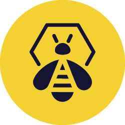

Thanks to all of the following I am writing those pages today.

## People

Penthium2: one teacher of a kind.

## Community

BZHack : https://www.bzhack.bzh/

BZHack is an association, born from a group of geeks passionate about computers, security and hacking

## Projects

Shuffle : https://shuffler.io/

Shuffle has made workflows that are available to anyone. These workflows are made using some of our favorite frameworks and tools, and are designed to help you get started with Shuffle using your own tools. Here are some samples.

Thehive-project : https://thehive-project.org/

 A scalable, open source and free Security Incident Response Platform, tightly integrated with MISP (Malware Information Sharing Platform), designed to make life easier for SOCs, CSIRTs, CERTs and any information security practitioner dealing with security incidents that need to be investigated and acted upon swiftly.
